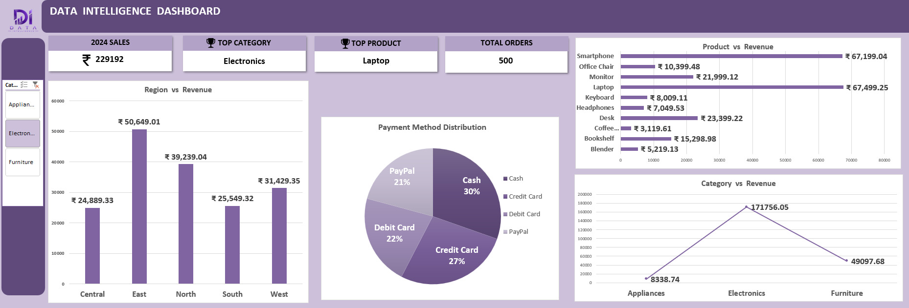

# 📊 Excel Data Intelligence Dashboard

### Business Intelligence and Sales Analytics Dashboard Using Microsoft Excel



---

## 📖 Overview

The Excel Data Intelligence Dashboard is an interactive business analytics solution developed using Microsoft Excel to transform raw sales data into meaningful business insights.

This dashboard provides a centralized view of key performance indicators (KPIs), product performance, regional revenue distribution, category analysis, and payment method trends, enabling data-driven decision-making through intuitive visualizations.

---

## 🎯 Business Objective

The primary objective of this project is to:

* Monitor overall business performance.
* Analyze sales and revenue trends.
* Identify top-performing products and categories.
* Compare revenue across regions.
* Understand customer payment preferences.
* Support strategic business decisions through data visualization.

---

## 🛠️ Tools & Techniques Used

* Microsoft Excel
* Pivot Tables
* Pivot Charts
* Slicers
* Dashboard Design
* KPI Cards
* Data Cleaning
* Business Intelligence Reporting
* Data Visualization

---

## 📊 Dashboard Features

### Key Performance Indicators (KPIs)

✔ Total Sales Revenue

✔ Total Orders Processed

✔ Top Performing Product

✔ Highest Revenue Category

---

### Business Analysis

#### Regional Revenue Analysis

* Compare revenue performance across regions.
* Identify high-performing geographic markets.

#### Product Performance Analysis

* Evaluate top-selling products.
* Understand product-wise revenue contribution.

#### Category Revenue Analysis

* Compare category-wise business performance.
* Identify the most profitable product categories.

#### Payment Method Distribution

* Analyze customer payment preferences.
* Understand transaction behavior.

---

## 📈 Key Insights

* Electronics emerged as the highest revenue-generating category.
* Laptop was identified as the top-performing product.
* The Central region generated the highest revenue contribution.
* Cash and Credit Card were the most preferred payment methods.
* Revenue distribution varied significantly across business categories.

---

## 📂 Repository Structure

```text
excel-data-intelligence-dashboard/
│
├── Dashboard.xlsx
├── Dataset.xlsx
├── Data_Intelligence_Dashboard.jpg
└── README.md
```

---

## 🚀 How to Use

1. Download the Excel workbook.
2. Open the file using Microsoft Excel.
3. Navigate through the dashboard.
4. Use interactive slicers to filter data dynamically.
5. Explore business insights and visual reports.

---

## 🎓 Skills Demonstrated

* Data Analysis
* Data Cleaning
* Dashboard Development
* Business Intelligence
* KPI Design
* Data Visualization
* Interactive Reporting
* Data Storytelling
* Microsoft Excel Analytics

---

## 📷 Dashboard Preview

The dashboard provides:

* Interactive filtering using slicers
* Revenue analysis by region
* Product performance insights
* Category-wise comparison
* Payment distribution analysis
* Executive-level KPI reporting

---

## 💡 Project Outcome

This project demonstrates how Microsoft Excel can be leveraged as a powerful Business Intelligence tool to analyze sales data, track key performance metrics, and communicate insights effectively through an interactive dashboard.

---

## 👩‍💻 Author

**Mansi Pawar**

Aspiring Data Analyst and aspiring AI/ML passionate about transforming data into actionable insights through analytics, visualization, and intelligent decision-making.


---

## ⭐ Support

If you found this project useful, consider giving it a star on GitHub.
